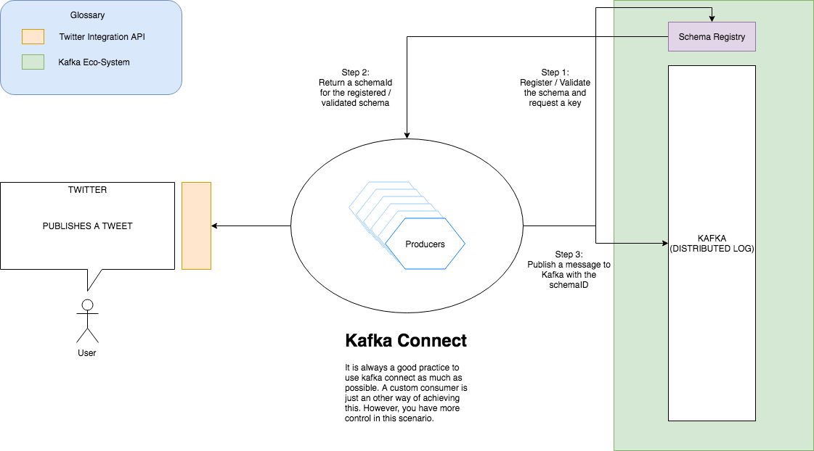

# Kafka Avro Message Producer

This application is used to publish messages to Kafka along with registering the schema in the [schema registry](). 

This application follows a [12-Factor App]() methodology.

> Note: This is just an alternative to Kafka Connect and should be used only in the case of some bespoke scenario's which cannot be accomplished using the connect cluster.

## Functional Requirement
Stream tweets from twitter for some specific hashtags and publish them into kafka

## Dataflow Diagram



## Prerequisits

You need to have the following before you can start using this application

* JDK 1.8 +
* Zookeeper
* Kafka
* [Schema Registry]()
* [Kafka Commons](https://github.com/reddy-s/kafka-commons) maven dependency
* Twitter Integration tokens

> Note: Once you have the twitter integration tokens, add them to the `kafka-avro-producer/src/main/resources/twitter4j.properties` file in the repo

## Setup process

Clone the repo and `cd` into the root directory of the repo.

Run the following command to build the application
```sbtshell
mvn clean install
```

Run the application using
```sbtshell
java -jar ./target/*.jar
```

The configuration for the application can be externalized by using a dedicated config server or by having a properties file.

The following are the available customizing options
```yaml
# Kafka settings
kafka:
  topic: Tweets
  bootstrap:
    servers: localhost:9092

# Schema settings
schema:
  registry:
    url: http://localhost:8081
  version: tweet:v1

# Twitter settings
twitter:
  hashtags: sport,politics,health

# Server settings
server:
  port: 10001

# Application information
info:
  app:
    name: Kafka Producer Application
    description: Read messages from twitter and push it to kafka (Alternative to Kafka Connect)
    version: 1.0.0

# Actuator Settings
management:
  endpoints:
    web:
      exposure:
        include: info,health,metrics,beans
```

### Monitoring and Operations

#### Application health
Uses Spring's Actuator project. This can be used to track the health of the application, application metrics and beans registered.

#### Logs
Makes use of `slf4j` for logging. All the logs are spit out to the console, but can be configured to do otherwise.

#### Operations
Prefered to run in a container, and `fluentd` can be used to ship the logs to a `fluentd` agent and searched in `Splunk` or `Elastic Search`.

`K8s` ready

## How to check if the application is running as expected

* As mentioned above, the applications health can be tracked vis the [Actuator]() endpoints. You can run [Confluent Platform](https://www.confluent.io/product/confluent-platform/)'s
console avro consumer by running the following

```sbtshell
./bin/kafka-avro-console-consumer --topic test \
         --zookeeper localhost:2181 \
         --from-beginning
```
> Note: Make sure you have Confluent's binaries

The schema would have been registered in the schema registry. You can check that out by issuing the following cURL command

```sbtshell
curl -X GET \
  http://localhost:8081/subjects/TweetRegistry/versions/latest \
  -H 'Cache-Control: no-cache' 
```

which would result in an output like this:

```json
{
    "subject": "TweetRegistry",
    "version": 2,
    "id": 12,
    "schema": "{\"type\":\"record\",\"name\":\"TweetRegistry\",\"fields\":[{\"name\":\"version\",\"type\":\"int\"},{\"name\":\"id\",\"type\":\"long\"},{\"name\":\"text\",\"type\":\"string\"},{\"name\":\"tweetedOn\",\"type\":\"string\",\"default\":\"null\"}]}"
}
```

Check out the [Kafka-Avro-Consumer](https://github.com/reddy-s/kafka-avro-consumer) which can be used to consume these tweets with a `BACKWARD` compatibility level of the schema.
